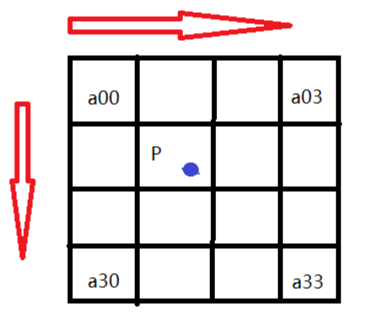
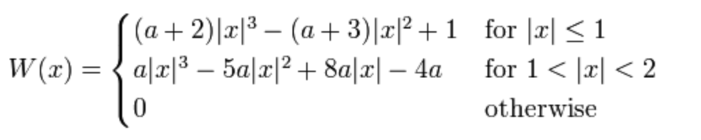
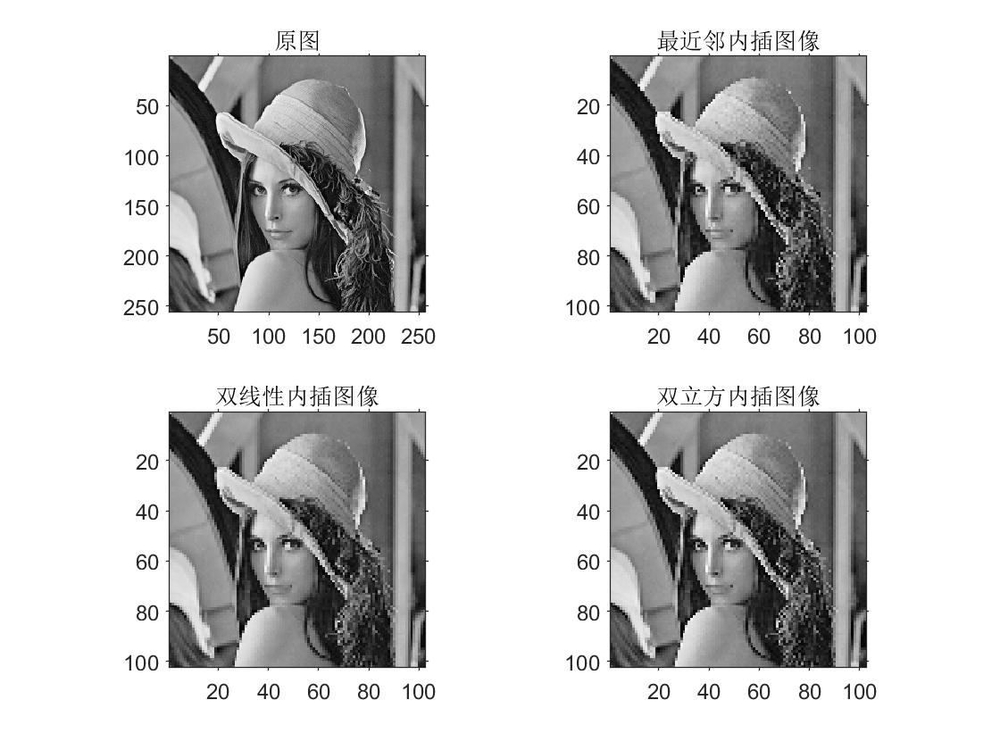
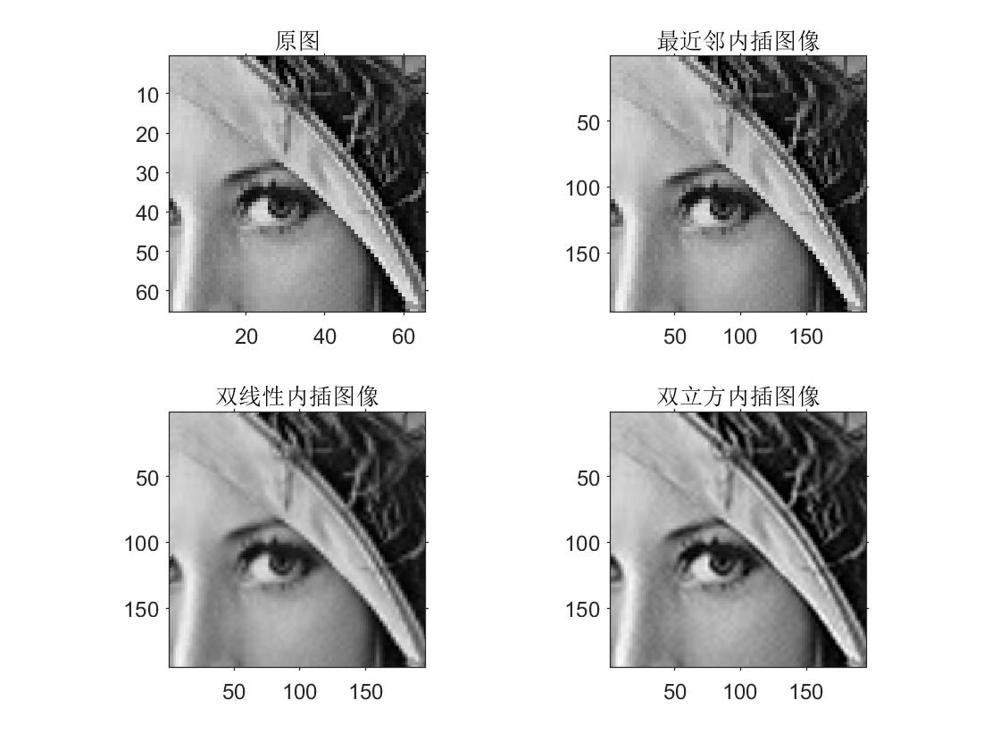
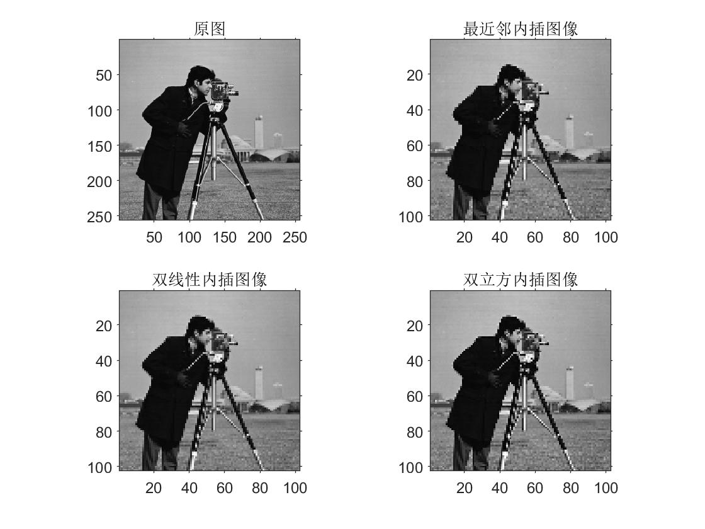
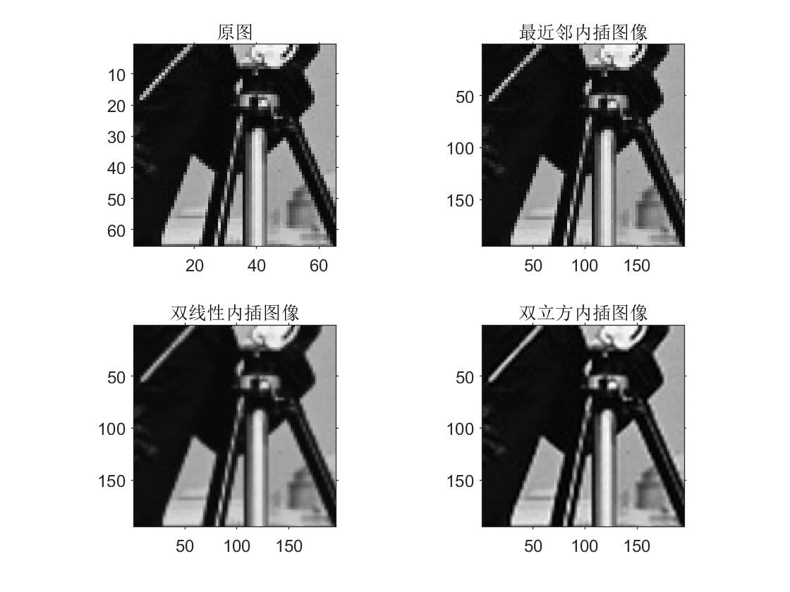
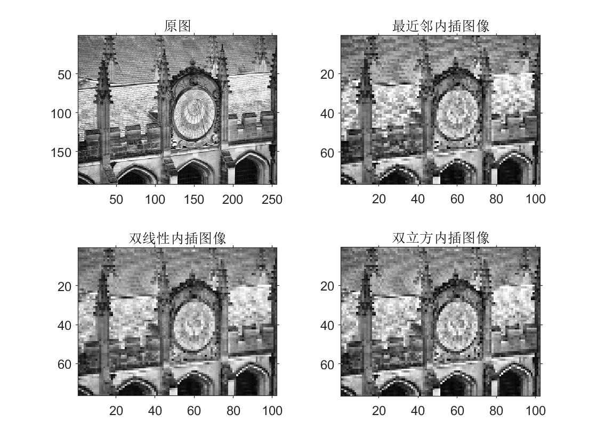
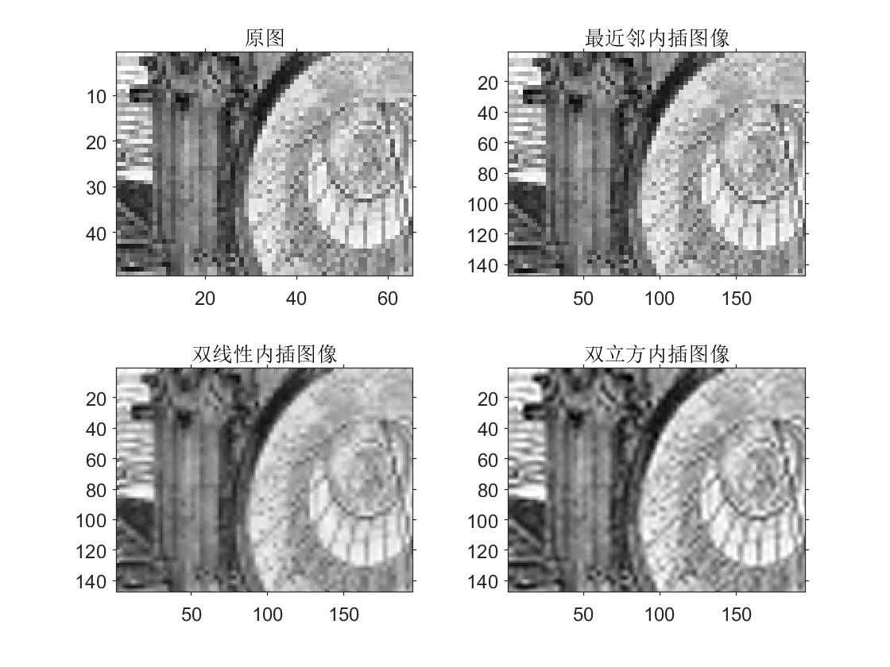

# <center>《数字图像处理》实验报告</center>


<font size=3>


**&nbsp; &nbsp; &nbsp; &nbsp; &nbsp; &nbsp; &nbsp; &nbsp; &nbsp; &nbsp; &nbsp; &nbsp; &nbsp; &nbsp;&nbsp; &nbsp; &nbsp; &nbsp; &nbsp;  &nbsp; &nbsp; &nbsp; &nbsp; &nbsp; &nbsp;  &nbsp;实验题目：<u>图像插值</u>**

**&nbsp; &nbsp; &nbsp;&nbsp; &nbsp; &nbsp; &nbsp; &nbsp; &nbsp; &nbsp; &nbsp; &nbsp; &nbsp; &nbsp; &nbsp; &nbsp; &nbsp; &nbsp; &nbsp; &nbsp; &nbsp; &nbsp; &nbsp; &nbsp; &nbsp; &nbsp; &nbsp;学生姓名：<u>王 志 强</u>**

**&nbsp;&nbsp; &nbsp; &nbsp; &nbsp; &nbsp; &nbsp; &nbsp; &nbsp; &nbsp; &nbsp; &nbsp; &nbsp; &nbsp; &nbsp; &nbsp; &nbsp; &nbsp; &nbsp; &nbsp; &nbsp; &nbsp; &nbsp; &nbsp; &nbsp; &nbsp;  学生学号：<u> PB18051049</u>**

**&nbsp;&nbsp; &nbsp;  &nbsp; &nbsp; &nbsp; &nbsp; &nbsp; &nbsp; &nbsp; &nbsp; &nbsp; &nbsp; &nbsp; &nbsp; &nbsp;&nbsp; &nbsp; &nbsp; &nbsp; &nbsp; &nbsp; &nbsp; &nbsp; &nbsp;  &nbsp; 完成日期：<u> 2021.03.30</u>**


</font>


**<center>计算机实验教学中心制</center>**

**<center>2019年9月</center>**


## 一、实验要求

1. 根据教材2.4.4节，实现三种插值算法：

- 最近邻内插

- 双线性内插

- 双三次内插

2. 对缩放后的图像细节进行简要的分析

## 二、实验原理

### 1. 最近邻内插

假设有一个$500\times 500$像素图像，我们想把他扩大为$1.5$倍，即$750\times 750$像素。在原始图像上放一个虚构的$750\times 750$栅格。很显然栅格的间隔应小于$1$个像素，因为我们是在一个较小的图像上拟合它。为了对覆盖层上的任何点进行灰度，我们在原图像上寻找最靠近的像素并把它的灰度值赋给栅格上的新像素。当对覆盖栅格的全部点都赋值完后，简单的把它扩大到原来的$1.5$倍，以得到放大的图像。这种灰度赋值法称为最近邻域内插。

### 2. 双线性内插

对于一个目的像素，设置坐标通过反向变换得到的浮点坐标为$(i+u,j+v)$ (其中$i,j$均为浮点坐标的整数部分，$u,v$为浮点坐标的小数部分，是取值$[0,1)$区间的浮点数)，则这个像素得值$f(i+u,j+v)$可由原图像中坐标为 $(i,j),(i+1,j),(i,j+1),(i+1,j+1)$所对应的周围四个像素的值决定，即：

$$
f(i+u,j+v) = (1-u)(1-v)f(i,j) + (1-u)vf(i,j+1) + u(1-v)f(i+1,j) + uvf(i+1,j+1)
$$
其中$f(i,j)$表示源图像$(i,j)$处的的像素值，以此类推。

### 3. 双三次内插

假设源图像$A$大小为$m\times n$，缩放$K$倍后的目标图像$B$的大小为$M\times N$，即$K=M/m$。$A$的每一个像素点是已知的，$B$是未知的，我们想要求出目标图像$B$中每一像素点$(X,Y)$的值，必须先找出像素$(X,Y)$在源图像$A$中对应的像素$(x,y)$，再根据源图像A距离像素$(x,y)$最近的$16$个像素点作为计算目标图像$B(X,Y)$处像素值的参数，利用BiCubic基函数求出$16$个像素点的权重，图$B$像素$(x,y)$的值就等于$16$个像素点的加权叠加。



根据比例关系$x/X=m/M=1/K$，我们可以得到$B(X,Y)$在$A$上的对应坐标为：
$$
A(x,y)=A(X\times \frac{m}{M},Y\times \frac{n}{N})=A(\frac{X}{K},\frac{Y}{K})
$$
如图所示$P$点就是目标图像$B$在$(X,Y)$处对应于源图像A中的位置，$P$的坐标位置会出现小数部分，所以我们假设$ P$的坐标为$P(x+u,y+v)$，其中$x,y$分别表示整数部分，$u,v$分别表示小数部分（蓝点到$a_{11}$方格中红点的距离）。那么我们就可以得到如图所示的最近$16$个像素的位置，在这里用$a(i,j),\ i,j=0,1,2,3$来表示，如上图。

双立方插值的目的就是通过找到一种关系，或者说系数，可以把这16个像素对于P处像素值得影响因子找出
来，从而根据这个影响因子来获得目标图像对应点的像素值，达到图像缩放的目的。
我在这次的学习中学习的是基于BiCubic基函数的双三次插值法，BiCubic基函数形式如下：



其中，$a$取$0.5$。

BiCubic函数具有如下形状：


我们要做的就是求出BiCubic函数中的参数$x$,从而获得上面所说的$16$个像素所对应的权重$W(x)$。BiCubic基函数是一维的，而像素是二维的，所以我们将像素点的行与列分开计算。BiCubic函数中的参数$x$表示该像素点到$P$点的距离，例如$a_{00}$距离$P(x+u,y+v)$的距离为$(1+u,1+v)$，因此$a_{00}$的横坐标权重$i_0=W(1+u)$，纵坐标权重$j_0=W(1+v)$，$a_{00}$对$B(X,Y)$的贡献值为：$Pixel(a_{00})\times i_0\times j_0$。因此，$a_{0x}$的横坐标权重分别为$W(1+u),W(u),W(1-u),W(2-u)$；$a_{y0}$的纵坐标权重分别为$W(1+v),W(v),W(1-v),W(2-v)$；$B(X,Y)$像素值为：
$$
B(X,Y)=\sum_{i=0}^{3}\sum_{j=0}^{4}a_{ij}\times W(i)\times W(j)
$$
对待插值的像素点$(x,y)$(x和y可以为浮点数)，取其附近的$4\times 4$邻域点$(x_i,y_j), i,j = 0,1,2,3$。按如下公式进行插值计算：
$$
f(x,y)=\sum_{i=0}^{3}\sum_{j=0}^{4}f(x_i,y_j)\times W(x-x_i)\times W(y-y_j)
$$

## 三、实验结果及分析

matlab代码框架已经给出，我对部分地方做了细微的修改，如下：

- 根据代码注释，图像放大测试使用的应该是提取出的中心块图像`im_center`。给出的代码都是将原始图像`im`作为函数参数传入，因此在图像放大测试中修改参数如下：

  ```matlab
  %% 将图像长宽缩放为原图的 ratio_2 (>1)倍
  im2_n = myNearest(im_center, ratio_2);
  im2_b = myBilinear(im_center, ratio_2);
  im2_c = myBicubic(im_center, ratio_2);
  ```

- 给出的`lenna`是rgb图像，我们将其转为gray图像进行处理

为了更好的进行对比，我们将三种内插方法的结果一起展示，其中每张图片都可以在`matlab\result`文件中找到。

### 1. 结果展示

- lenna缩放结果





- cameraman缩放结果





- building缩放结果





### 2. 细节分析

- 最近邻内插

最近邻插值法的优点是计算量很小，算法也简单，因此运算速度较快。但它仅使用离待测采样点最近的像素的灰度值作为该采样点的灰度值，而没考虑其他相邻像素点的影响，因而<font color="red">重新采样后灰度值有明显的不连续性，图像质量损失较大，会产生明显的马赛克和锯齿现象。</font>

- 双线性内插

双线性插值法效果要好于最近邻插值，只是计算量稍大一些，算法复杂些，程序运行时间也稍长些，但缩放后图像质量高，基本克服了最近邻插值灰度值不连续的特点，因为它考虑了待测采样点周围四个直接邻点对该采样点的相关性影响。但是，此方法仅考虑待测样点周围四个直接邻点灰度值的影响, 而未考虑到各邻点间灰度值变化率的影响, 因此具有低通滤波器的性质, 从而<font color="red">导致缩放后图像的高频分量受到损失, 图像边缘在一定程度上变得较为模糊</font>。用此方法缩放后的输出图像与输入图像相比, 仍然存在由于插值函数设计考虑不周而产生的<font color="red">图像质量受损与计算精度不高的问题。</font>

- 双三次内插

双三次插值法计算量最大，算法也是最为复杂的。在几何运算中，双线性内插法的平滑作用可能会使图像的细节产生退化，在进行放大处理时，这种影响更为明显。在其他应用中，双线性插值的斜率不连续性会产生不希望的结果。立方卷积插值不仅考虑到周围四个直接相邻像素点灰度值的影响，还考虑到它们灰度值变化率的影响。因此克服了前两种方法的不足之处，<font color="red">能够产生比双线性插值更为平滑的边缘，计算精度很高，处理后的图像像质损失最少，效果是最佳的。</font>

总之，在进行图像缩放处理时，应根据实际情况对三种算法做出选择，既要考虑时间方面的可行性，又要对变换后图像质量进行考虑，这样才能达到较为理想的结果。

## 四、源码展示

这里只展示补充的代码部分，完整代码可以在`matlab`文件夹中查看。

### 1. myNearest.m

```matlab
function [img_2] = nearest(img_1, n)

%.............%

img_1 = im2double(img_1);%unit8->double

for i=1:h_2
    for j=1:w_2
    	%找最近邻
        m=round(i/n);
        k=round(j/n);
        %边界点问题处理
        if m<1
            m=1;
        end
        if k<1
            k=1;
        end
        if m>h_1
            m=h_1;
        end
        if k>w_1
            k=w_1;
        end
        img_2(i,j)=img_1(m,k);
    end
end
img_2 = im2uint8(img_2);%返回图像

```

### 2. myBilinear.m

```matlab
function [img_2] = bilinear(img_1, n)

%.............%

img_1 = im2double(img_1);
for p=1:h_2
    for q=1:w_2
        x = p / n; y = q / n;
        i = floor(x); j = floor(y);
        %该值不会超过原图上边界，因为都是做的floor处理
        %对于边界问题可以有多种处理方案，可以选择扩充原图像
        %我这里选择对边界点单独处理
        row = max(i,1); column = max(j,1);%边界点选择
        if i==0 || j==0  || i==h_1 || j==w_1
            img_2(p,q) = img_1(row, column);
        else
            u = x - i;
            v = y - j;
            img_2(p,q)=img_1(i,j)*(1-u)*(1-v) + ...
                       img_1(i,j+1)*(1-u)*v + ...
                       img_1(i+1,j)*u*(1-v) +  ...
                       img_1(i+1,j+1)*u*v;
        end
        
    end
end
img_2 = im2uint8(img_2);
```

### 3. myBicubic.m

```matlab
function [img_2] = bicubicr(img_1, n)

%.............%

img_1 = im2double(img_1);

for dstx = 1:h_2
    x = floor(dstx/n); u = dstx/n - x;
    %逼近函数，A = s[]
    A = [sw(u+1), sw(u), sw(u-1), sw(u-2)];
    for dsty = 1:w_2
        y = floor(dsty/n); v = dsty/n - y;
        %逼近函数，C = s[]
        C = [sw(v+1); sw(v); sw(v-1); sw(v-2)];
        %考虑到边界像素，分类讨论得到插值计算区域矩阵 B[]
        xi = max(1,x-1); xx = max(1,x); xa = min(h_1,x+1); xaa = min(h_1,x+2);
        yi = max(1,y-1); yy = max(1,y); ya = min(w_1,y+1); yaa = min(w_1,y+2);
        if xi~=x-1||yi~=y-1||xaa~=x+2||yaa~=y+2
            B = [img_1(xi,yi),img_1(xi,yy),img_1(xi,ya),img_1(xi,yaa);
                 img_1(xx,yi),img_1(xx,yy),img_1(xx,ya),img_1(xx,yaa);
                 img_1(xa,yi),img_1(xa,yy),img_1(xa,ya),img_1(xa,yaa);
                 img_1(xaa,yi),img_1(xaa,yy),img_1(xaa,ya),img_1(xaa,yaa)];
        else
             B = img_1(xi:xaa,yi:yaa);%非边界像素
        end

        %插值主运算 A*B*C
        img_2(dstx,dsty) = (A*B)*C;
    end
end
%Bicubic函数
function A=sw(x)
w=abs(x);
if w<1 && w>=0
    A = 1-2*w^2+w^3;
else
    if w>=1 && w<2
        A = 4-8*w+5*w^2-w^3;
    else
        A=0;
    end
end
end
img_2 = im2uint8(img_2);
```