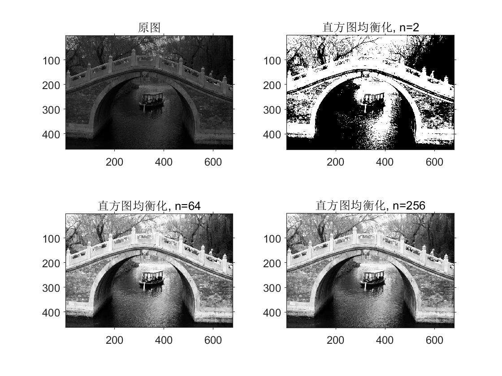
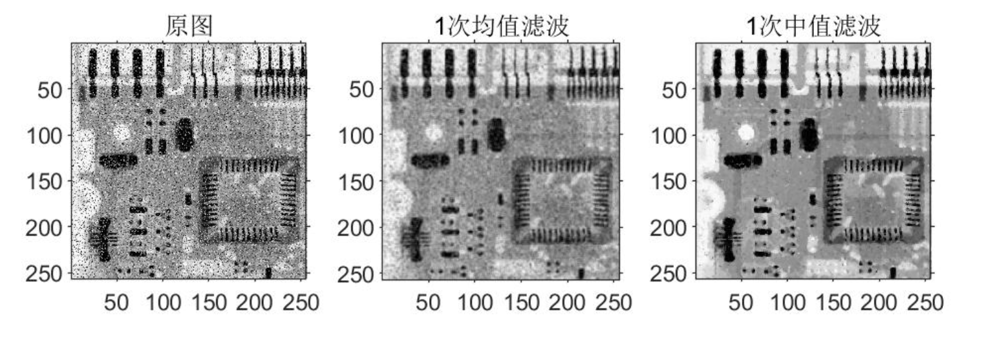
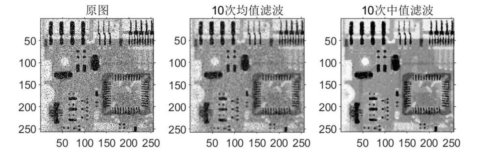
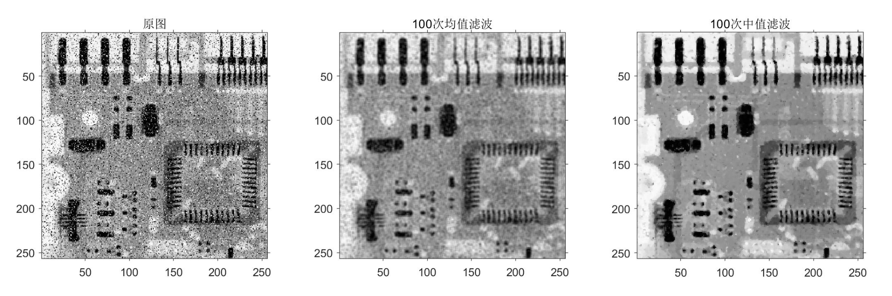
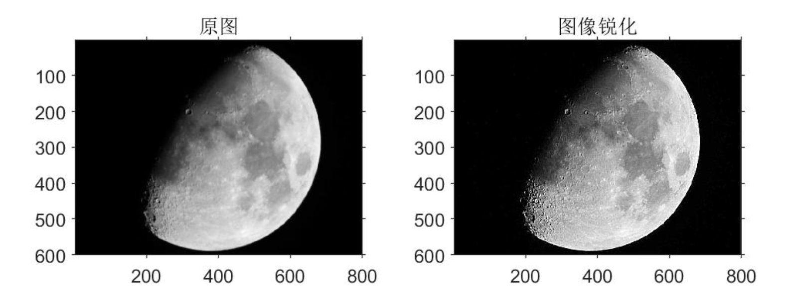

# <center>《数字图像处理》实验报告</center>


<font size=3>


**&nbsp; &nbsp; &nbsp; &nbsp; &nbsp; &nbsp; &nbsp; &nbsp; &nbsp; &nbsp; &nbsp; &nbsp; &nbsp; &nbsp;&nbsp; &nbsp; &nbsp; &nbsp; &nbsp;  &nbsp; &nbsp; &nbsp; &nbsp; &nbsp; &nbsp;  &nbsp;实验题目：<u>图像变换与空域滤波</u>**

**&nbsp; &nbsp; &nbsp;&nbsp; &nbsp; &nbsp; &nbsp; &nbsp; &nbsp; &nbsp; &nbsp; &nbsp; &nbsp; &nbsp; &nbsp; &nbsp; &nbsp; &nbsp; &nbsp; &nbsp; &nbsp; &nbsp; &nbsp; &nbsp; &nbsp; &nbsp; &nbsp;学生姓名：<u>王 志 强</u>**

**&nbsp;&nbsp; &nbsp; &nbsp; &nbsp; &nbsp; &nbsp; &nbsp; &nbsp; &nbsp; &nbsp; &nbsp; &nbsp; &nbsp; &nbsp; &nbsp; &nbsp; &nbsp; &nbsp; &nbsp; &nbsp; &nbsp; &nbsp; &nbsp; &nbsp; &nbsp;  学生学号：<u> PB18051049</u>**

**&nbsp;&nbsp; &nbsp;  &nbsp; &nbsp; &nbsp; &nbsp; &nbsp; &nbsp; &nbsp; &nbsp; &nbsp; &nbsp; &nbsp; &nbsp; &nbsp;&nbsp; &nbsp; &nbsp; &nbsp; &nbsp; &nbsp; &nbsp; &nbsp; &nbsp;  &nbsp; 完成日期：<u> 2021.04.06</u>**


</font>


**<center>计算机实验教学中心制</center>**

**<center>2019年9月</center>**


## 一、实验要求

1. 图像直方图均衡化

2. 图像空域滤波：
   - 均值滤波（滤波次数$n\rightarrow \infin$）
   - 中值滤波（滤波次数$n\rightarrow \infin$）
   - 图像锐化（拉普拉斯算子）

## 二、直方图均衡化

灰度直方图，反应了数字图像中每一灰度级与该灰度出现的频率之间的对应关系。直方图均衡化可以不改变像素的位置，只改变像素的灰度值，通过这种方法做到增强图像的对比度、使感兴趣的部分看的更清楚。

### 1. 实验思路

把原始图像的灰度直方图从比较集中的某个灰度区间变成在全部灰度范围内的均匀分布。直方图均衡化就是对图像进行非线性拉伸，重新分配图像像素值，使一定灰度范围内的像素数量大致相同。首先计算原始图像的像素的直方图分布，记录在数组PDF中之后计算出图像的直方图的累计分布，记录在数组CDF中，之后根据公式：
$$
img2(i,j) = round( (n-1)\times \frac{CDF(img1(i,j) + 1)}{h\times w})
$$
计算出像素转化后的结果。

### 2. 代码实现

```matlab
function [img_2] = myHisteq(img_1, n) 

size_1 = size(img_1);
h = size_1(1);
w = size_1(2);
img_2 = zeros(h, w);

L = 256;    %0-255共L个灰度值
PDF = zeros(L,1);  %PDF是图像的直方图分布
for i = 1:h
    for j = 1:w
        num = img_1(i,j) + 1;
        PDF(num) = PDF(num) + 1;
    end
end
CDF = zeros(L,1); %CDF是图像的直方图的累计分布
for i = 1:L
    for j = 1:i
        CDF(i) = CDF(i) + PDF(j);
    end
end
%向量化循环
i = 1:h;
j = 1:w;
img_2(i,j) = round( (n-1) * CDF(img_1(i,j) + 1)/(h * w));
img_2 = uint8(img_2 * (L-1) / (n-1));

end
```

### 3. 结果及分析

下图分别是灰度级为 2、64 以及 256 的直方图均衡化的结果对比：



从上述实验结果可以看出，经过直方图均衡化后的图片的对比度更高，有利于人眼的观看识别。直方图均衡化可以达到增强图像的显示效果的作用。通过原图像的直方图可以观察出，图像中各种亮度所占的比例大都分布不均匀，直方图增强的方法就是压缩直方图中比例少的像素所占用的灰度范围，多出来的灰度空间按照统计比例分配给直方图中比例高的像素使用。这种方法主要是针对人眼对灰度差别越大的图像更容易分辨的特点而做的增强。

直方图均衡化由于可能会丢失一些灰度级，所以造成图片信息在一定程度上的损失。变换后图像的灰度级减少也会使某些细节消失。并且某些图像经均衡化处理后的对比度不自然的过分增强。

## 三、图像空域滤波

### 1. 均值滤波和中值滤波

#### 1.1 实验思路

- 均值滤波首先取出计算的像素点$3\times 3$范围内的所有的点，之后利用其灰度值求均值，计算结果为滤波后的当前像素点的灰度值
- 中值滤波首先取出计算的像素点$3\times 3$范围内的所有的点，之后进行按像素的灰度值的大小排序，取中位数作为当前像素点的值

#### 1.2 代码实现

均值滤波函数实现：

```matlab
function [img_2] = myAverage(img_1)  

size_1 = size(img_1);
h = size_1(1);
w = size_1(2);
img_2 = zeros(h, w);

%%边缘延拓两行两列
a = img_1(1,:);
b = img_1(h,:);
img_1 = [a;img_1;b];
c = img_1(:,1);
d = img_1(:,w);
img_1 = double([c,img_1,d]);

%3X3均值模板
L = 1/9*[1 1 1;1 1 1;1 1 1];

for i= 1:h
    for j = 1:w
        im = img_1(i:i+2, j:j+2);
        img_2(i,j) = round(sum(sum(L.*im)));
    end
end
img_2 = uint8(img_2);
end
```

中值滤波函数实现，把求均值改为求中位数即可，关键代码如下：

```matlab
for i= 1:h
    for j = 1:w
        img = img_1(i:i+2, j:j+2);
        img_2(i,j) = median(img(:));
    end
end
```

#### 1.3 结果及分析

逐渐增加滤波次数，来观察图像变化情况：

- 单次滤波

  

- 10次滤波

  

- 100次滤波

  

平滑滤波：能减弱或者消除图像中高频率分量，但不影响低频率分量，在实际应用中可用来消除噪声。均值滤波和和中值滤波都可以起到平滑图像，虑去噪声的功能。

均值滤波采用线性的方法，平均整个窗口范围内的像素值，均值滤波本身存在着固有的缺陷，即它不能很好地保护图像细节，在图像去噪的同时也破坏了图像的细节部分，从而使图像变得模糊，不能很好地去除噪声点。均值滤波对高斯噪声表现较好，对椒盐噪声表现较差。

中值滤波采用非线性的方法，它在平滑脉冲噪声方面非常有效, 同时它可以保护图像尖锐的边缘，选择适当的点来替代污染点的值，所以处理效果好，对椒盐噪声表现较好，对高斯噪 声表现较差。

滤波次数的影响，随着滤波的次数逐渐增加，均值滤波计算的结果越来越模糊，这是因为均值滤波的本质是低通滤波器，多次迭代之后，图像保留的部分的频率越来越低，最后不难猜测图像的结果是各个像素点的灰度值相同。这是中值滤波不会发生和上面相似的情况，但是图像的部分高频的细节被当做噪声消除，图像变得过于平滑。理论上说无限次的中值的最终结果是使图像的高频成分彻底丧失，比如图像的细节或者纹理成分，但是会保留一些低频的图像细节。

### 2. 锐化滤波

图像锐化是针对常见的图像模糊、边缘不清晰所采用的的处理方法，与平滑滤波相反，它 能够减弱或者消除图像中低频率分量，但不影响高频率分量，可使图像反差增加，加强图像的轮廓，是图像变得比较清晰。主要的目的：突出灰度的过度部分。

#### 2.1 实验思路

利用二阶微分算子拉普拉斯算子进行图像的锐化，本次使用的$3\times 3$模板是
$$
\left[\begin{matrix}-1&-1&-1\\-1&8&-1\\-1&-1&-1\end{matrix}\right]
$$
首先取出计算的像素点$3\times 3$范围内的所有的点，之后进行按模板的参数加权求和，最后再加上原图像的灰度值，可以得到锐化后的像素点灰度值。

#### 2.2 代码实现

```matlab
function [img_2] = mySharpen(img_1) 

size_1 = size(img_1);
h = size_1(1);
w = size_1(2);
img_2 = zeros(h, w);

%%边缘延拓两行两列
a = img_1(1,:);
b = img_1(h,:);
img_1 = [a;img_1;b];
c = img_1(:,1);
d = img_1(:,w);
img_1 = double([c,img_1,d]);

%拉普拉斯算子
L = [-1 -1 -1;-1 8 -1;-1 -1 -1];

for i= 1:h
    for j = 1:w
        im = img_1(i:i+2,j:j+2);
        img_2(i,j) = round(sum(sum(L.*im)));
        img_2(i,j) = img_2(i,j) + img_1(i+1,j+1);
    end
end

img_2 = im2uint8(img_2/255);
end
```

#### 2.3 结果及分析

锐化处理前后的效果如下：



通过对数字图像进行锐化处理，可以增强图像的边缘，使模糊的图像变得清晰起来，用Laplacian算子可以达到细节增强的目的。

# 四、实验小结

本次实验，研究了灰度变换中的直方图均衡，通过直方图均衡来改变像素分布位置，从而提高图像的对比度，对于图像来说，处理结果比较理想。但是如果变换后图像的灰度级减少，也会导致图像某些细节的消失。

之后研究空域滤波中的两种平滑滤波算法和一种锐化滤波算法。在实验中分析研究了平滑滤波的本质是低通滤波，对于均值滤波，它不能很好地保护图像细节，在图像去噪的同时也破坏了图像的细节部分，但是通过分析可以知道对于高斯噪声它有很好的消除效果。对于中值滤波，它可以保护图像尖锐的边缘，选择适当的点来替代污染点的值，对椒盐噪声表现较好，但是对高斯噪声表现较差。对于锐化滤波，可以突出图像的边缘细节，让模糊的图片变得清晰，增强细节。
